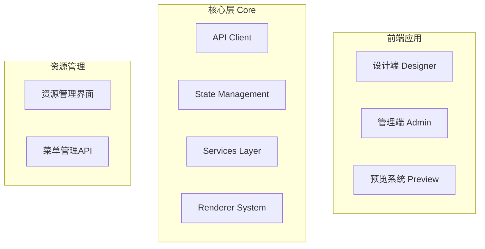
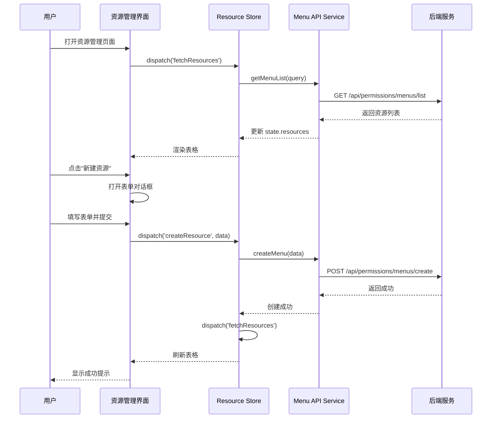
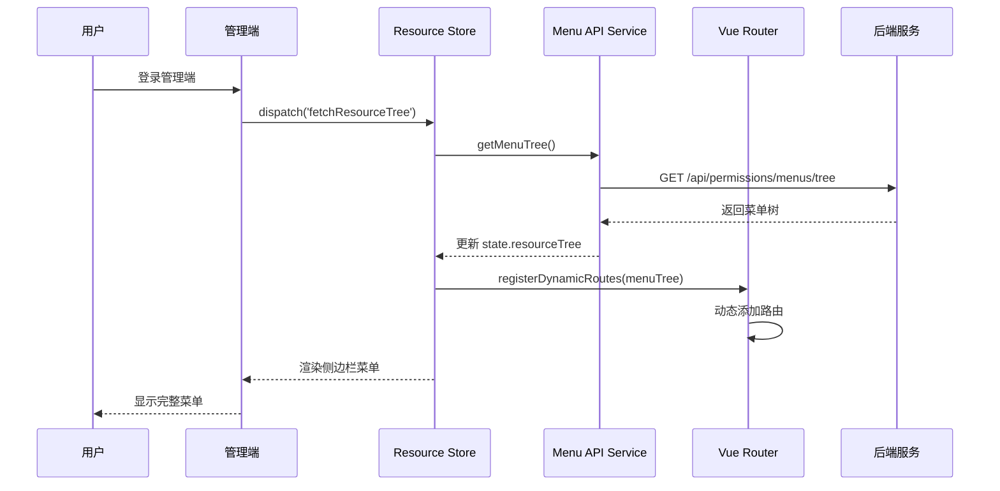

# 资源管理系统设计文档

## 概述

资源管理系统是一个完整的企业级解决方案，包含三个核心部分：

1. **预览功能增强** - 修复并美化现有的设计器预览功能
2. **资源管理中心** - 基于菜单管理 API 的资源配置界面
3. **中后台管理系统** - 独立的管理端应用，用于系统管理和资源配置

### 设计原则

- **代码优先**: 框架和核心界面通过代码生成，保证稳定性和可维护性
- **配置驱动**: 菜单和权限通过资源配置动态生成，提供灵活性
- **架构集成**: 深度集成现有项目架构（DI容器、状态管理、API层等）
- **模块化设计**: 采用模块化架构，支持独立开发和部署
- **用户体验**: 提供现代化、响应式的用户界面

## 架构设计

### 系统架构图



    Designer --> Core
    Admin --> Core
    Preview --> Core
    ResourceUI --> ResourceAPI
    Admin --> ResourceUI
    Designer --> ResourceUI
    Core --> ResourceAPI

    subgraph "后端服务"
        MenuAPI[菜单管理接口]
        AuthAPI[认证授权接口]
        DataAPI[数据接口]
    end

    ResourceAPI --> MenuAPI
    API --> MenuAPI
    API --> AuthAPI
    API --> DataAPI

```

### 技术栈

- **前端框架**: Vue 3 + TypeScript
- **UI组件库**: Ant Design Vue
- **状态管理**: Pinia (通过 StateManager 封装)
- **路由**: Vue Router
- **构建工具**: Vite
- **HTTP客户端**: Axios (通过 ApiClient 封装)
- **图标**: Ant Design Icons + 自定义图标库

## 组件和接口设计

### 1. 预览功能增强

#### 1.1 组件结构

```

src/modules/designer/views/
├── Preview.vue (主预览组件 - 需要重构)
└── PreviewEnhanced.vue (新增 - 增强版预览)

```

#### 1.2 核心功能

**PreviewEnhanced.vue 组件设计**:
```

```typescript
interface PreviewData {
  view: RootView
  dataSources?: Record<string, any>
  dataFlows?: Record<string, any>
  dataActions?: Record<string, any>
  timestamp: number
}

interface PreviewState {
  loading: boolean
  error: string | null
  data: PreviewData | null
  device: 'desktop' | 'tablet' | 'mobile'
  orientation: 'portrait' | 'landscape'
  isFullscreen: boolean
  customSize: { width: number; height: number }
}
```

**数据加载流程**:

1. 从 URL 参数获取预览模式（temp/saved）
2. temp 模式：从 sessionStorage 读取数据
3. saved 模式：调用 API 加载保存的设计
4. 数据验证和错误处理
5. 渲染预览内容

#### 1.3 UI 美化设计

**设计风格**:

- 现代化扁平设计
- 柔和的阴影和圆角
- 流畅的过渡动画
- 响应式布局

**颜色方案**:

- 主色调: #1890ff (Ant Design 蓝)
- 成功色: #52c41a
- 警告色: #faad14
- 错误色: #f5222d
- 背景色: #f0f2f5
- 卡片背景: #ffffff

### 2. 资源管理界面

#### 2.1 目录结构

```
src/modules/designer/views/
├── ResourceManagement.vue (资源管理主页面)
└── components/
    ├── ResourceTable.vue (资源表格)
    ├── ResourceForm.vue (资源表单)
    ├── ResourceTree.vue (资源树视图)
    └── ResourceFilters.vue (筛选器)
```

#### 2.2 数据模型

```typescript
interface MenuResource {
  id: number
  parentId: number | null
  menuCode: string
  name: string
  module: string
  nodeType: 1 | 2 | 3 // 1=文件夹, 2=页面, 3=按钮
  nodeTypeText: string
  sortOrder: number
  url?: string
  icon?: string
  path?: string
  meta?: string
  createdAt: string
}

interface MenuTreeNode extends MenuResource {
  children?: MenuTreeNode[]
}

interface ResourceQuery {
  name?: string
  menuCode?: string
  module?: string
  nodeType?: number
  parentId?: number
  page: number
  size: number
}

interface ResourcePageResult {
  data: MenuResource[]
  total: number
  page: number
  size: number
  totalPages: number
  hasNext: boolean
  hasPrevious: boolean
}
```

#### 2.3 API 服务层

```typescript
// src/core/api/menu.ts
export class MenuApiService {
  constructor(private apiClient: ApiClient) {}

  // 查询菜单列表
  async getMenuList(query: ResourceQuery): Promise<ApiResponse<ResourcePageResult>> {
    return this.apiClient.get('/api/permissions/menus/list', { params: query })
  }

  // 获取菜单树
  async getMenuTree(): Promise<ApiResponse<MenuTreeNode[]>> {
    return this.apiClient.get('/api/permissions/menus/tree')
  }

  // 创建菜单
  async createMenu(data: Partial<MenuResource>): Promise<ApiResponse<void>> {
    return this.apiClient.post('/api/permissions/menus/create', data)
  }

  // 更新菜单
  async updateMenu(data: MenuResource): Promise<ApiResponse<void>> {
    return this.apiClient.put('/api/permissions/menus/update', data)
  }

  // 删除菜单
  async deleteMenu(id: number): Promise<ApiResponse<void>> {
    return this.apiClient.delete(`/api/permissions/menus/delete/${id}`)
  }
}
```

#### 2.4 状态管理

```typescript
// src/core/state/modules/resource.ts
export const resourceModule: StateModule = {
  name: 'resource',
  state: {
    resources: [] as MenuResource[],
    resourceTree: [] as MenuTreeNode[],
    currentResource: null as MenuResource | null,
    loading: false,
    query: {
      page: 1,
      size: 10,
      name: '',
      menuCode: '',
      module: '',
      nodeType: undefined,
    } as ResourceQuery,
    pagination: {
      total: 0,
      page: 1,
      size: 10,
      totalPages: 0,
    },
  },
  getters: {
    filteredResources: state => state.resources,
    resourceById: state => (id: number) => state.resources.find(r => r.id === id),
  },
  actions: {
    async fetchResources({ state, commit }) {
      commit('setLoading', true)
      try {
        const response = await menuApiService.getMenuList(state.query)
        if (response.success) {
          commit('setResources', response.data.data)
          commit('setPagination', {
            total: response.data.total,
            page: response.data.page,
            size: response.data.size,
            totalPages: response.data.totalPages,
          })
        }
      } finally {
        commit('setLoading', false)
      }
    },
    async fetchResourceTree({ commit }) {
      const response = await menuApiService.getMenuTree()
      if (response.success) {
        commit('setResourceTree', response.data)
      }
    },
    async createResource({ dispatch }, data: Partial<MenuResource>) {
      await menuApiService.createMenu(data)
      await dispatch('fetchResources')
    },
    async updateResource({ dispatch }, data: MenuResource) {
      await menuApiService.updateMenu(data)
      await dispatch('fetchResources')
    },
    async deleteResource({ dispatch }, id: number) {
      await menuApiService.deleteMenu(id)
      await dispatch('fetchResources')
    },
  },
  mutations: {
    setResources(state, resources: MenuResource[]) {
      state.resources = resources
    },
    setResourceTree(state, tree: MenuTreeNode[]) {
      state.resourceTree = tree
    },
    setCurrentResource(state, resource: MenuResource | null) {
      state.currentResource = resource
    },
    setLoading(state, loading: boolean) {
      state.loading = loading
    },
    setQuery(state, query: Partial<ResourceQuery>) {
      state.query = { ...state.query, ...query }
    },
    setPagination(state, pagination: any) {
      state.pagination = pagination
    },
  },
}
```

### 3. 中后台管理系统

#### 3.1 模块结构

```
src/modules/admin/
├── index.html (管理端入口HTML)
├── main.ts (管理端入口JS)
├── App.vue (管理端根组件)
├── router/
│   └── index.ts (管理端路由配置)
├── views/
│   ├── Layout.vue (管理端布局)
│   ├── Dashboard.vue (仪表板)
│   ├── Login.vue (登录页)
│   └── NotFound.vue (404页面)
├── components/
│   ├── AppHeader.vue (顶部栏)
│   ├── AppSidebar.vue (侧边栏)
│   ├── AppFooter.vue (底部栏)
│   ├── AppLogo.vue (LOGO组件)
│   └── DynamicMenu.vue (动态菜单)
└── assets/
    └── logo-tech.svg (高科技感LOGO)
```

#### 3.2 管理端布局设计

**布局风格**: 参考现代化仪表板设计（Dashgum Free风格）

**布局特点**:

- 深色侧边栏（#2c3e50）
- 黄色顶部栏（#f6bb42）带欢迎提示
- 主内容区域包含统计卡片、图表和数据展示
- 右侧活动面板显示通知和团队成员
- 卡片式设计，带阴影和圆角

**Layout.vue 组件结构**:

```vue
<template>
  <a-layout class="admin-layout">
    <!-- 侧边栏 -->
    <a-layout-sider v-model:collapsed="collapsed" :trigger="null" collapsible :width="220" class="admin-sider">
      <AppLogo :collapsed="collapsed" />
      <DynamicMenu :menu-tree="menuTree" />
    </a-layout-sider>

    <!-- 主内容区 -->
    <a-layout>
      <!-- 顶部栏 -->
      <a-layout-header class="admin-header">
        <AppHeader :collapsed="collapsed" @toggle-sidebar="collapsed = !collapsed" />
      </a-layout-header>

      <!-- 内容区 -->
      <a-layout-content class="admin-content">
        <router-view v-slot="{ Component }">
          <transition name="fade" mode="out-in">
            <component :is="Component" />
          </transition>
        </router-view>
      </a-layout-content>
    </a-layout>
  </a-layout>
</template>
```

#### 3.3 动态菜单组件

**DynamicMenu.vue 设计**:

```typescript
interface MenuProps {
  menuTree: MenuTreeNode[]
}

// 菜单渲染逻辑
const renderMenu = (nodes: MenuTreeNode[]) => {
  return nodes
    .filter(node => node.nodeType !== 3) // 过滤按钮类型
    .sort((a, b) => a.sortOrder - b.sortOrder)
    .map(node => {
      if (node.nodeType === 1 && node.children?.length) {
        // 文件夹类型，渲染为子菜单
        return {
          key: node.menuCode,
          icon: node.icon,
          label: node.name,
          children: renderMenu(node.children),
        }
      } else if (node.nodeType === 2) {
        // 页面类型，渲染为菜单项
        return {
          key: node.menuCode,
          icon: node.icon,
          label: node.name,
          path: node.path,
        }
      }
    })
}
```

#### 3.4 LOGO 设计

**AppLogo.vue 组件**:

- 使用 SVG 格式的高科技感 LOGO
- 支持展开/收起状态
- 展开时显示完整 LOGO + 文字
- 收起时仅显示图标

**LOGO 设计要求**:

- 科技感：使用几何图形、线条、渐变
- 颜色：蓝色系（#1890ff, #0050b3）+ 渐变效果
- 动画：鼠标悬停时的微动画效果
- 尺寸：适配侧边栏宽度（240px 展开，80px 收起）

#### 3.5 管理端路由配置

```typescript
// src/modules/admin/router/index.ts
import type { RouteRecordRaw } from 'vue-router'

const Layout = () => import('../views/Layout.vue')
const Dashboard = () => import('../views/Dashboard.vue')
const Login = () => import('../views/Login.vue')

export const routes: RouteRecordRaw[] = [
  {
    path: '/login',
    name: 'AdminLogin',
    component: Login,
    meta: { title: '登录', requiresAuth: false },
  },
  {
    path: '/',
    component: Layout,
    redirect: '/dashboard',
    meta: { requiresAuth: true },
    children: [
      {
        path: 'dashboard',
        name: 'Dashboard',
        component: Dashboard,
        meta: { title: '仪表板', icon: 'DashboardOutlined' },
      },
      // 动态路由将在运行时根据资源配置添加
    ],
  },
  {
    path: '/:pathMatch(.*)*',
    name: 'NotFound',
    component: () => import('../views/NotFound.vue'),
  },
]

// 动态路由注册函数
export function registerDynamicRoutes(router: Router, menuTree: MenuTreeNode[]) {
  const routes = generateRoutesFromMenu(menuTree)
  routes.forEach(route => {
    router.addRoute('AdminLayout', route)
  })
}

function generateRoutesFromMenu(nodes: MenuTreeNode[]): RouteRecordRaw[] {
  const routes: RouteRecordRaw[] = []

  for (const node of nodes) {
    if (node.nodeType === 2 && node.path) {
      // 页面类型，生成路由
      routes.push({
        path: node.path,
        name: node.menuCode,
        component: () => import(`../views/${node.meta?.component || 'Default'}.vue`),
        meta: {
          title: node.name,
          icon: node.icon,
          menuCode: node.menuCode,
        },
      })
    }

    if (node.children) {
      routes.push(...generateRoutesFromMenu(node.children))
    }
  }

  return routes
}
```

#### 3.6 管理端入口配置

```typescript
// src/modules/admin/main.ts
import { AppInit } from '@/core/index'
import { routes } from './router'
import AdminApp from './App.vue'
import { registerBasicControls } from '@/core/renderer/controls/register'
import { initializeIconLibraries } from '@/core/renderer/icons'

// 初始化图标库
initializeIconLibraries()

// 注册基础控件（如果需要）
registerBasicControls()

// 初始化管理端应用
AppInit('#app', routes, [], async app => {
  app.component('AdminApp', AdminApp)

  // 开发环境配置
  if (import.meta.env.DEV) {
    console.log('✅ 管理端模块已启动')
  }
})
```

### 4. 构建配置

#### 4.1 Vite 配置更新

需要在 `vite.config.ts` 中添加管理端的端口映射：

```typescript
const portMap: Record<string, number> = {
  designer: 5173,
  admin: 5174, // 新增管理端端口
  mobile: 5175,
}
```

#### 4.2 环境变量

创建 `envs/.env.admin` 文件：

```env
VITE_APP_MODEL=admin
VITE_TITLE=资源管理系统
VITE_SERVICE_URL=http://localhost:8080
NODE_ENV=development
```

#### 4.3 构建脚本

在 `package.json` 中添加管理端构建脚本：

```json
{
  "scripts": {
    "dev:admin": "vite --mode admin",
    "build:admin": "vite build --mode admin",
    "preview:admin": "vite preview --mode admin"
  }
}
```

## 数据流设计

### 资源管理流程



### 动态菜单加载流程



## 错误处理

### API 错误处理策略

```typescript
// src/core/api/menu.ts
export class MenuApiService {
  private handleError(error: any): never {
    if (error.response) {
      const { status, data } = error.response

      switch (status) {
        case 400:
          throw new Error(data.message || '请求参数错误')
        case 401:
          // 跳转到登录页
          router.push('/login')
          throw new Error('未授权，请重新登录')
        case 403:
          throw new Error('权限不足')
        case 404:
          throw new Error('资源不存在')
        case 409:
          throw new Error(data.message || '资源冲突')
        case 500:
          throw new Error('服务器内部错误')
        default:
          throw new Error(data.message || '未知错误')
      }
    } else if (error.request) {
      throw new Error('网络请求失败，请检查网络连接')
    } else {
      throw new Error(error.message || '请求配置错误')
    }
  }

  async getMenuList(query: ResourceQuery): Promise<ApiResponse<ResourcePageResult>> {
    try {
      return await this.apiClient.get('/api/permissions/menus/list', { params: query })
    } catch (error) {
      this.handleError(error)
    }
  }
}
```

### UI 错误提示

```typescript
// 使用 Ant Design Vue 的 message 组件
import { message } from 'ant-design-vue'

// 成功提示
message.success('操作成功')

// 错误提示
message.error('操作失败：' + error.message)

// 警告提示
message.warning('请先选择要操作的资源')

// 加载提示
const hide = message.loading('正在加载...', 0)
// 操作完成后
hide()
```

## 测试策略

### 单元测试

**测试覆盖范围**:

- API Service 层的所有方法
- State Module 的 actions 和 mutations
- 工具函数和辅助方法

**测试框架**: Vitest

```typescript
// 示例：MenuApiService 测试
describe('MenuApiService', () => {
  let service: MenuApiService
  let mockApiClient: jest.Mocked<ApiClient>

  beforeEach(() => {
    mockApiClient = {
      get: jest.fn(),
      post: jest.fn(),
      put: jest.fn(),
      delete: jest.fn(),
    } as any
    service = new MenuApiService(mockApiClient)
  })

  it('should fetch menu list successfully', async () => {
    const mockData = {
      success: true,
      data: {
        data: [],
        total: 0,
        page: 1,
        size: 10,
      },
    }
    mockApiClient.get.mockResolvedValue(mockData)

    const result = await service.getMenuList({ page: 1, size: 10 })

    expect(mockApiClient.get).toHaveBeenCalledWith('/api/permissions/menus/list', { params: { page: 1, size: 10 } })
    expect(result).toEqual(mockData)
  })
})
```

### 集成测试

**测试场景**:

- 资源管理界面的完整 CRUD 流程
- 动态菜单加载和路由注册
- 预览功能的数据加载和渲染

### E2E 测试

**测试工具**: Playwright

**测试用例**:

1. 用户登录管理端
2. 创建新资源
3. 编辑资源
4. 删除资源
5. 查看资源树
6. 切换菜单导航

## 性能优化

### 前端优化

1. **代码分割**

   - 路由懒加载
   - 组件按需加载
   - 第三方库分包

2. **缓存策略**

   - API 响应缓存（使用 ApiClient 的缓存功能）
   - 静态资源缓存
   - Service Worker 缓存

3. **渲染优化**

   - 虚拟滚动（大数据表格）
   - 防抖和节流
   - 图片懒加载

4. **打包优化**
   - Tree Shaking
   - 代码压缩
   - Gzip 压缩

### 后端优化建议

1. **数据库优化**

   - 添加索引（menuCode, module, parentId）
   - 查询优化
   - 分页查询

2. **缓存策略**

   - Redis 缓存菜单树
   - 缓存失效策略

3. **API 优化**
   - 响应压缩
   - 批量操作接口
   - 增量更新

## 安全设计

### 认证和授权

```typescript
// 路由守卫
router.beforeEach(async (to, from, next) => {
  const requiresAuth = to.meta.requiresAuth

  if (requiresAuth) {
    const token = localStorage.getItem('access_token')

    if (!token) {
      next('/login')
      return
    }

    // 验证 token 有效性
    try {
      await authService.validateToken(token)
      next()
    } catch (error) {
      localStorage.removeItem('access_token')
      next('/login')
    }
  } else {
    next()
  }
})
```

### 权限控制

```typescript
// 按钮权限指令
app.directive('permission', {
  mounted(el, binding) {
    const { value } = binding
    const permissions = store.getState('user').permissions || []

    if (value && !permissions.includes(value)) {
      el.parentNode?.removeChild(el)
    }
  },
})

// 使用示例
<a-button v-permission="'menu:create'">新建</a-button>
```

### XSS 防护

```typescript
// 输入清理
import DOMPurify from 'dompurify'

function sanitizeInput(input: string): string {
  return DOMPurify.sanitize(input)
}

// 在表单提交前清理
const formData = {
  name: sanitizeInput(form.name),
  menuCode: sanitizeInput(form.menuCode),
  // ...
}
```

### CSRF 防护

```typescript
// API Client 自动添加 CSRF Token
apiClient.interceptors.request.use(config => {
  const csrfToken = document.querySelector('meta[name="csrf-token"]')?.getAttribute('content')
  if (csrfToken) {
    config.headers['X-CSRF-Token'] = csrfToken
  }
  return config
})
```

## 国际化支持

### i18n 配置

```typescript
// src/core/i18n/index.ts
import { createI18n } from 'vue-i18n'
import zhCN from './locales/zh-CN.json'
import enUS from './locales/en-US.json'

export const i18n = createI18n({
  legacy: false,
  locale: 'zh-CN',
  fallbackLocale: 'en-US',
  messages: {
    'zh-CN': zhCN,
    'en-US': enUS,
  },
})
```

### 语言文件

```json
// src/core/i18n/locales/zh-CN.json
{
  "resource": {
    "title": "资源管理",
    "create": "新建资源",
    "edit": "编辑资源",
    "delete": "删除资源",
    "confirmDelete": "确定要删除这个资源吗？",
    "fields": {
      "name": "资源名称",
      "menuCode": "菜单编码",
      "module": "业务模块",
      "nodeType": "节点类型",
      "sortOrder": "排序序号"
    }
  }
}
```

## 部署方案

### 开发环境

```bash
# 启动设计端
npm run dev:designer

# 启动管理端
npm run dev:admin

# 同时启动多个端（使用 concurrently）
npm run dev:all
```

### 生产环境

#### 方案 1: 统一部署

```bash
# 构建所有模块
npm run build:all

# 部署到同一服务器
dist/
├── designer/
│   ├── index.html
│   └── assets/
└── admin/
    ├── index.html
    └── assets/

# Nginx 配置
server {
  listen 80;
  server_name example.com;

  location /designer {
    alias /var/www/dist/designer;
    try_files $uri $uri/ /designer/index.html;
  }

  location /admin {
    alias /var/www/dist/admin;
    try_files $uri $uri/ /admin/index.html;
  }

  location /api {
    proxy_pass http://backend:8080;
  }
}
```

#### 方案 2: 分离部署

```bash
# 分别构建
npm run build:designer
npm run build:admin

# 部署到不同服务器或域名
designer.example.com -> dist/designer
admin.example.com -> dist/admin
```

### Docker 部署

```dockerfile
# Dockerfile
FROM node:18-alpine as builder

WORKDIR /app
COPY package*.json ./
RUN npm ci

COPY . .
RUN npm run build:all

FROM nginx:alpine
COPY --from=builder /app/dist /usr/share/nginx/html
COPY nginx.conf /etc/nginx/nginx.conf

EXPOSE 80
CMD ["nginx", "-g", "daemon off;"]
```

## 监控和日志

### 前端监控

```typescript
// 错误监控
window.addEventListener('error', event => {
  console.error('Global error:', event.error)
  // 发送到监控服务
  sendToMonitoring({
    type: 'error',
    message: event.error.message,
    stack: event.error.stack,
    url: window.location.href,
    timestamp: Date.now(),
  })
})

// 性能监控
window.addEventListener('load', () => {
  const perfData = performance.getEntriesByType('navigation')[0]
  console.log('Page load time:', perfData.loadEventEnd - perfData.fetchStart)
  // 发送到监控服务
})
```

### 日志系统

```typescript
// src/core/utils/logger.ts
export class Logger {
  private static instance: Logger

  static getInstance(): Logger {
    if (!Logger.instance) {
      Logger.instance = new Logger()
    }
    return Logger.instance
  }

  info(message: string, data?: any) {
    console.log(`[INFO] ${message}`, data)
    this.send('info', message, data)
  }

  error(message: string, error?: any) {
    console.error(`[ERROR] ${message}`, error)
    this.send('error', message, error)
  }

  warn(message: string, data?: any) {
    console.warn(`[WARN] ${message}`, data)
    this.send('warn', message, data)
  }

  private send(level: string, message: string, data?: any) {
    // 发送到日志服务
    if (import.meta.env.PROD) {
      // 生产环境发送到远程日志服务
    }
  }
}

export const logger = Logger.getInstance()
```

## 文档和维护

### 代码文档

- 使用 JSDoc 注释关键函数和类
- 使用 TypeScript 类型定义
- README 文件说明项目结构和开发指南

### API 文档

- 使用 Swagger/OpenAPI 规范
- 自动生成 API 文档
- 提供交互式 API 测试界面

### 变更日志

维护 CHANGELOG.md 文件，记录每个版本的变更：

```markdown
# Changelog

## [1.0.0] - 2025-10-13

### Added

- 资源管理界面
- 中后台管理系统
- 预览功能增强

### Changed

- 优化 API 调用性能
- 改进错误处理机制

### Fixed

- 修复预览页面数据加载问题
```

## 总结

本设计文档详细描述了资源管理系统的架构、组件、数据流、安全性和部署方案。主要特点：

1. **模块化架构**: 设计端、管理端、预览系统独立但共享核心层
2. **配置驱动**: 菜单和权限通过资源配置动态生成
3. **深度集成**: 与现有项目架构（DI、状态管理、API层）无缝集成
4. **安全可靠**: 完善的认证授权和错误处理机制
5. **易于维护**: 清晰的代码结构和完善的文档

下一步将根据此设计创建详细的实施任务列表。
